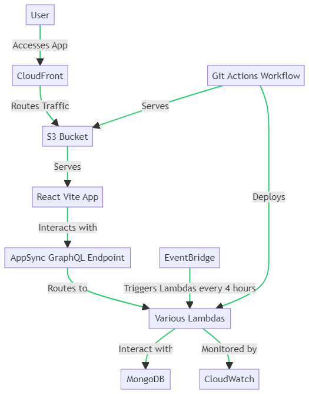

# Project Name

Project description goes here.

## Table of Contents

- [Installation](#installation)
- [Usage](#usage)
- [Features](#features)
- [Contributing](#contributing)
- [License](#license)

## Installation

Instructions for installing the project and its dependencies.

## Features

- Feature 1: Description of feature 1.
- Feature 2: Description of feature 2.
- ...

## Contributing

Guidelines for contributing to the project. Include information about how to submit bug reports, suggest enhancements, and contribute code.

## License

This project is licensed under the [License Name](LICENSE).
